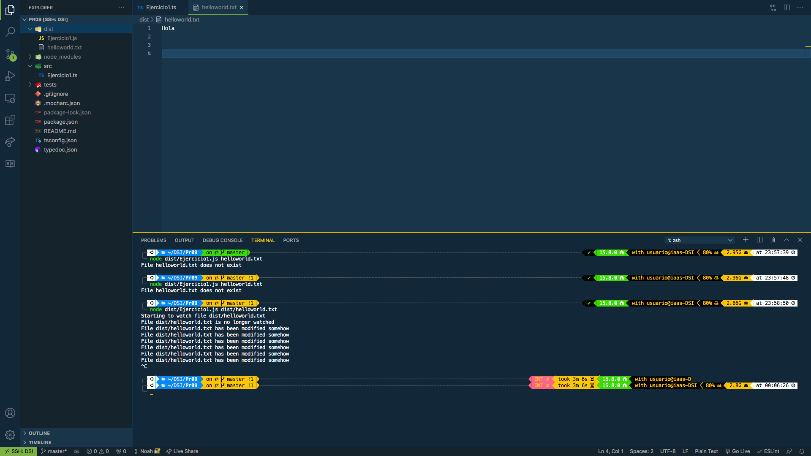

# Informe Practica 9

# Introduccion

# Ejercicio 1



* Ejecucion del programa

Como vemos, si ejecutamos el programa con un archivo que no existe, nos indica por pantalla que este no se encuentra. En caso contrario si este existiese, no imprime por pantalla que el programa esta empezando a observar el archivo, para observar modificaciones en el. Acto seguido imprime por pantalla que el archivo ya no esta siendo observado, lo explicaremos mas adelante. Mientras tanto, si modificamos el archivo, nos muestra dos veces por pantalla que el archivo ha sido modificado, si lo volvemos a modificar, nos vuelvea mostrar el mismo mensaje por segunda vez. Acabamos la ejecucion del programa al ingresar por teclado ```ctrl + C```

* Contenido de Pila y registro de eventos.